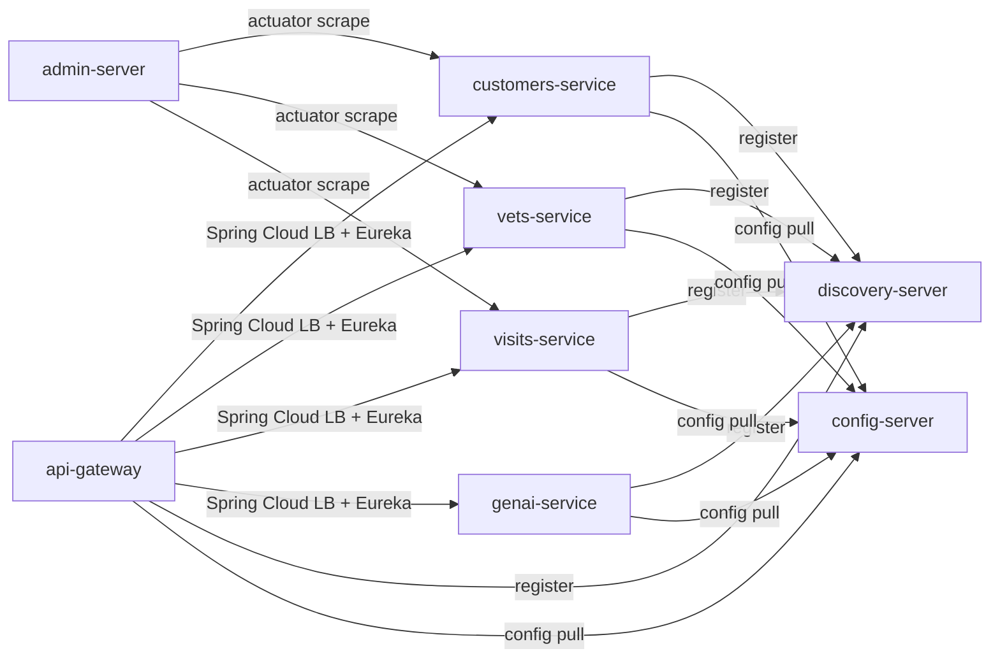

# Spring PetClinic — Group 4 Platform Architecture

**Project:** Spring PetClinic Microservices  
**Team:** Group 4 — DevOps Journey (Pravin Mishra Cohort)  
**AWS Region:** `us-east-1`  
**Account ID:** `338593158888`  
**Domain:** `petclinic-group4.com`

---

## Table of Contents

1. [System Overview](#1-system-overview)
2. [Repository Structure](#2-repository-structure)
3. [Application Layer — Microservices](#3-application-layer--microservices)
4. [Network Architecture](#4-network-architecture)
5. [Kubernetes Platform (EKS)](#5-kubernetes-platform-eks)
6. [CI/CD Pipeline](#6-cicd-pipeline)
7. [GitOps — ArgoCD](#7-gitops--argocd)
8. [Data Layer — RDS MySQL](#8-data-layer--rds-mysql)
9. [Secrets Management](#9-secrets-management)
10. [IAM & Identity](#10-iam--identity)
11. [Container Registry — ECR](#11-container-registry--ecr)
12. [DNS & TLS](#12-dns--tls)
13. [Autoscaling — Karpenter](#13-autoscaling--karpenter)
14. [Terraform Module Dependency Graph](#14-terraform-module-dependency-graph)
15. [Environment Strategy](#15-environment-strategy)
16. [Request Flow — End to End](#16-request-flow--end-to-end)
17. [Naming Convention](#17-naming-convention)
18. [Security Boundaries](#18-security-boundaries)

---

## 1. System Overview

```
┌─────────────────────────────────────────────────────────────────────────┐
│                        INTERNET / USERS                                  │
└──────────────────────────────┬──────────────────────────────────────────┘
                               │  HTTPS (443) / HTTP redirect (80)
                               ▼
                   ┌───────────────────────┐
                   │   Route 53 (DNS)       │
                   │  staging.petclinic-    │
                   │  group4.com (A/AAAA)  │
                   └───────────┬───────────┘
                               │
                               ▼
                   ┌───────────────────────┐
                   │   AWS ALB             │
                   │  (internet-facing)    │
                   │  TLS 1.3 (ACM cert)   │
                   │  HTTP→HTTPS redirect  │
                   └───────────┬───────────┘
                               │
                    ┌──────────▼──────────┐
                    │    AWS EKS Cluster   │
                    │  spc-stg-ue1-eks-   │
                    │       main          │
                    │                     │
                    │  ┌───────────────┐  │
                    │  │  api-gateway  │  │
                    │  │  :8080        │  │
                    │  └──────┬────────┘  │
                    │         │ Spring    │
                    │         │ Cloud LB  │
                    │  ┌──────┴──────┐   │
                    │  │  8 backend  │   │
                    │  │  services   │   │
                    │  └──────┬──────┘   │
                    └─────────┼──────────┘
                              │
              ┌───────────────┼────────────────┐
              │               │                │
              ▼               ▼                ▼
    ┌──────────────┐ ┌──────────────┐ ┌──────────────┐
    │  RDS MySQL   │ │  Secrets     │ │  ECR         │
    │  (private    │ │  Manager     │ │  (9 repos)   │
    │   subnets)   │ │              │ │              │
    └──────────────┘ └──────────────┘ └──────────────┘
```

The platform is a **GitOps-driven, container-based microservices deployment on AWS EKS**. Infrastructure is defined in Terraform, application packaging in Helm, and deployment orchestrated by ArgoCD. A merge to the `staging` branch is the sole deploy trigger — no manual `kubectl` or `helm` commands are needed after initial bootstrap.

---

## 2. Repository Structure

There are two repositories. They are independent but reference each other through IAM OIDC trust policies and Kubernetes resource names.

```
spring-petclinic-Group-4-DMI/
├── spring-petclinic-microservices/     ← APPLICATION REPO
│   ├── spring-petclinic-api-gateway/
│   ├── spring-petclinic-config-server/
│   ├── spring-petclinic-discovery-server/
│   ├── spring-petclinic-customers-service/
│   ├── spring-petclinic-vets-service/
│   ├── spring-petclinic-visits-service/
│   ├── spring-petclinic-visits-service/
│   ├── spring-petclinic-genai-service/
│   ├── spring-petclinic-admin-server/
│   ├── docker/Dockerfile               ← shared multi-stage Dockerfile
│   └── .github/workflows/
│       └── maven-build.yml             ← CI: compile + unit tests
│
└── spring-petclinic-Group-4-infra/     ← INFRA REPO (this repo)
    ├── terraform/
    │   ├── environments/staging/       ← single entry point for staging
    │   └── modules/                    ← 10 reusable modules
    │       ├── iam/
    │       ├── vpc/
    │       ├── ecr/
    │       ├── secrets/
    │       ├── eks/
    │       ├── karpenter/
    │       ├── alb/
    │       ├── dns/
    │       ├── rds/
    │       └── s3/
    ├── helm/                           ← one chart per microservice
    │   ├── api-gateway/
    │   ├── config-server/
    │   └── ... (9 total)
    ├── argocd/
    │   ├── projects/petclinic-project.yaml
    │   └── applications/               ← 9 Application manifests
    └── db/migrations/                  ← Flyway SQL (V1–V6)
```

### Branch Strategy

| Branch    | Purpose                               | Deploy target         |
|-----------|---------------------------------------|-----------------------|
| `staging` | Integration branch, deploy trigger    | `petclinic-staging` ns |
| `main`    | Production-ready, protected           | `petclinic-prod` ns   |
| `infra/*` | Terraform changes, requires 2 reviews | —                     |
| `helm/*`  | Helm chart changes                    | —                     |
| `fix/*`   | Bug fixes                             | —                     |

> PRs always target `staging`. Promotion from `staging` → `main` triggers the production deploy.

---

## 3. Application Layer — Microservices

### Service Map

```
                        ┌─────────────────────────────────────┐
                        │           api-gateway :8080          │
                        │   (Spring Cloud Gateway + Eureka LB) │
                        └──────┬──────┬──────┬────────────────┘
                               │      │      │
               ┌───────────────┘      │      └──────────────────┐
               │                      │                          │
               ▼                      ▼                          ▼
    ┌──────────────────┐   ┌──────────────────┐   ┌──────────────────┐
    │ customers-service│   │  vets-service    │   │  visits-service  │
    │      :8081       │   │     :8083        │   │     :8082        │
    │  (MySQL via RDS) │   │  (MySQL via RDS) │   │  (MySQL via RDS) │
    └──────────────────┘   └──────────────────┘   └──────────────────┘

    ┌──────────────────┐   ┌──────────────────┐   ┌──────────────────┐
    │  genai-service   │   │  config-server   │   │ discovery-server │
    │   (OpenAI API)   │   │  :8888 (Spring   │   │  :8761 (Eureka)  │
    │                  │   │  Cloud Config)   │   │                  │
    └──────────────────┘   └──────────────────┘   └──────────────────┘

    ┌──────────────────┐   ┌──────────────────┐
    │  admin-server    │   │    frontend      │
    │  :9090 (Spring   │   │   (static UI)    │
    │  Boot Admin)     │   │                  │
    └──────────────────┘   └──────────────────┘
```

### Service Responsibilities

| Service | Port | Spring Profile | Description |
|---|---|---|---|
| `config-server` | 8888 | `kubernetes` | Central configuration source for all services. Pulls config from GitHub `spring-petclinic/spring-petclinic-microservices-config`. |
| `discovery-server` | 8761 | `kubernetes` | Eureka service registry. All services register here; `api-gateway` uses it for client-side load balancing. |
| `api-gateway` | 8080 | `kubernetes` | Single external entry point. Routes `/api/vet/**`, `/api/visit/**`, `/api/customer/**` to backend services. Has circuit breaker + retry filters. |
| `customers-service` | 8081 | `kubernetes,mysql` | Manages pet owner and pet data. Writes to RDS MySQL. |
| `vets-service` | 8083 | `kubernetes,mysql` | Manages veterinarian data. Reads from RDS MySQL. |
| `visits-service` | 8082 | `kubernetes,mysql` | Manages appointment/visit data. Writes to RDS MySQL. |
| `genai-service` | — | `kubernetes` | AI-powered features using OpenAI API. Key sourced from Secrets Manager. |
| `admin-server` | 9090 | `kubernetes` | Spring Boot Admin UI — shows health/metrics for all registered services. |
| `frontend` | — | `kubernetes` | Static web UI served by the api-gateway or as a separate pod. |

### Inter-Service Communication



All service-to-service calls are **internal ClusterIP** — no traffic leaves the cluster. Only `api-gateway` is exposed externally through the ALB Ingress.

---

## 4. Network Architecture

### VPC Layout

```
VPC: spc-stg-ue1-vpc-main  (10.0.0.0/16)
│
├── us-east-1a
│   ├── Public Subnet:  spc-stg-ue1-az1-sn-public   (10.0.1.0/24)
│   │   └── NAT Gateway: spc-stg-ue1-vpc-nat
│   └── Private Subnet: spc-stg-ue1-az1-sn-private  (10.0.3.0/24)
│       ├── EKS worker nodes
│       └── RDS MySQL (AZ1)
│
└── us-east-1b
    ├── Public Subnet:  spc-stg-ue1-az2-sn-public   (10.0.2.0/24)
    └── Private Subnet: spc-stg-ue1-az2-sn-private  (10.0.4.0/24)
        ├── EKS worker nodes
        └── RDS MySQL (AZ2, standby in prod)
```

### Routing

| Source | Destination | Path |
|---|---|---|
| Public subnets → internet | 0.0.0.0/0 | Internet Gateway (`spc-stg-ue1-vpc-igw`) |
| Private subnets → internet | 0.0.0.0/0 | NAT Gateway (in public AZ1) |
| EKS nodes → RDS | 10.0.0.0/16 | VPC internal routing |
| Internet → ALB | 80, 443 | Internet Gateway |
| ALB → EKS pods | 8080 | ALB Security Group → EKS Node SG |

### Security Groups

```
ALB Security Group (spc-stg-ue1-vpc-sg-alb)
  Inbound:  TCP 80  from 0.0.0.0/0
            TCP 443 from 0.0.0.0/0
  Outbound: TCP 8080 → EKS Node SG

EKS Node Security Group (spc-stg-ue1-vpc-sg-eks-node)
  Inbound:  ALL from EKS Node SG (node-to-node)
            TCP 8080 from ALB SG
  Outbound: ALL to 0.0.0.0/0

RDS Security Group (spc-stg-ue1-rds-sg)
  Inbound:  TCP 3306 from EKS Node SG only
  Outbound: ALL (return traffic)
```

---

## 5. Kubernetes Platform (EKS)

### Cluster Configuration

| Property | Value |
|---|---|
| Cluster name | `spc-stg-ue1-eks-main` |
| Kubernetes version | 1.29+ |
| Authentication mode | `API` (not ConfigMap-based) |
| Endpoint access | Public + Private |
| Cluster logging | API, audit, authenticator |
| Subnets | Private AZ1 + AZ2 |

### Node Groups

```
Managed Node Group: spc-stg-ue1-eks-ng-main
  Instance type:   var.node_instance_type
  Desired:         var.node_desired_size
  Min:             var.node_min_size
  Max:             var.node_max_size
  Subnets:         private AZ1 + AZ2
  Labels:          role=general
  Tags:            karpenter.sh/discovery=spc-stg-ue1-eks-main
```

### Kubernetes Namespaces

| Namespace | Contents |
|---|---|
| `petclinic-staging` | All 9 application services (staging) |
| `petclinic-prod` | All 9 application services (prod — future) |
| `argocd` | ArgoCD controller, server, repo-server, application-set |
| `karpenter` | Karpenter controller pods |
| `kube-system` | AWS Load Balancer Controller, CoreDNS, kube-proxy |

### AWS Load Balancer Controller

Installed by Terraform via Helm into `kube-system`. Uses IRSA (IAM Roles for Service Accounts) to call AWS APIs. When ArgoCD deploys the `api-gateway` Helm chart, the controller reads the `kubernetes_ingress_v1` annotations and provisions/updates the ALB automatically.

```
Ingress: spc-stg-ue1-api-gateway-ingress
  Annotations:
    kubernetes.io/ingress.class: alb
    alb.ingress.kubernetes.io/scheme: internet-facing
    alb.ingress.kubernetes.io/target-type: ip
    alb.ingress.kubernetes.io/certificate-arn: <ACM arn>
    alb.ingress.kubernetes.io/ssl-policy: ELBSecurityPolicy-TLS13-1-2-2021-06
    alb.ingress.kubernetes.io/ssl-redirect: "443"
    alb.ingress.kubernetes.io/listen-ports: [{"HTTP":80},{"HTTPS":443}]
    alb.ingress.kubernetes.io/healthcheck-path: /actuator/health
  Rules:
    /* → api-gateway:8080
```

### HPA (Horizontal Pod Autoscaler)

All 9 services have HPA enabled (via Helm `autoscaling.enabled: true`):

| Environment | Min Replicas | Max Replicas | CPU Target |
|---|---|---|---|
| Staging | 1 | 3 | 70% |
| Production | 2 | 6 | 70% |

---

## 6. CI/CD Pipeline

```
Developer pushes code
        │
        ▼
┌───────────────────────────────────────────────────────────────────────┐
│                     GitHub Actions (App Repo)                          │
│                                                                         │
│  Trigger: push to any branch / PR to staging or main                  │
│                                                                         │
│  Job: build-and-test                                                   │
│  ├── actions/checkout@v4                                               │
│  ├── actions/setup-java@v4  (Java 17, Temurin, Maven cache)           │
│  ├── ./mvnw clean install -B  (compile + unit tests, all modules)     │
│  └── upload-artifact: surefire XML reports (7-day retention)          │
│                                                                         │
│  Job: build-push  (TODO — see gaps)                                    │
│  ├── aws-actions/configure-aws-credentials  (OIDC, no static keys)    │
│  ├── aws-actions/amazon-ecr-login                                      │
│  ├── docker build  (per service, multi-stage Dockerfile)              │
│  │   Tags: <ECR>/<service>:<git-sha>  and  :<latest>                  │
│  └── docker push → ECR                                                 │
└───────────────────────────────────────────────────────────────────────┘
        │
        │  Image tag update committed to infra repo values-staging.yaml
        ▼
┌───────────────────────────────────────────────────────────────────────┐
│                     GitHub Actions (Infra Repo)                        │
│                                                                         │
│  Trigger: PR to staging / main                                         │
│                                                                         │
│  Job: terraform-validate  (TODO — currently broken CI)                 │
│  ├── terraform fmt -recursive -check                                   │
│  └── terraform validate                                                │
└───────────────────────────────────────────────────────────────────────┘
        │
        │  Merge to staging branch
        ▼
┌───────────────────────────────────────────────────────────────────────┐
│                     ArgoCD  (in-cluster)                               │
│                                                                         │
│  Watches: staging branch of infra repo (every 3 minutes or webhook)   │
│  Detects: change in helm/<service>/values-staging.yaml                 │
│  Action:  helm upgrade <service> ./helm/<service>                      │
│           -f values-staging.yaml                                       │
│           --namespace petclinic-staging                                │
│                                                                         │
│  Sync policy: automated, prune, selfHeal, retry 3× (exp. backoff)     │
└───────────────────────────────────────────────────────────────────────┘
```

### Docker Build — Multi-Stage Dockerfile

Located at `docker/Dockerfile` in the app repo. Used for all 9 services.

```dockerfile
# Stage 1: Extract layered JAR for optimised caching
FROM eclipse-temurin:17 AS builder
WORKDIR application
ARG ARTIFACT_NAME
COPY ${ARTIFACT_NAME}.jar application.jar
RUN java -Djarmode=layertools -jar application.jar extract

# Stage 2: Minimal runtime image
FROM eclipse-temurin:17
WORKDIR application
ARG EXPOSED_PORT
EXPOSE ${EXPOSED_PORT}
ENV SPRING_PROFILES_ACTIVE=docker

# Layered copy — maximises Docker layer cache reuse across builds
COPY --from=builder application/dependencies/ ./
COPY --from=builder application/spring-boot-loader/ ./
COPY --from=builder application/snapshot-dependencies/ ./
COPY --from=builder application/application/ ./
ENTRYPOINT ["java", "org.springframework.boot.loader.launch.JarLauncher"]
```

### GitHub Actions — OIDC Authentication (No Static Secrets)

```
GitHub Actions Runner
        │
        │  Request JWT with:
        │    sub = repo:spring-petclinic-Group-4-DMI/<repo>:ref:refs/heads/staging
        │    aud = sts.amazonaws.com
        ▼
token.actions.githubusercontent.com (GitHub OIDC IdP)
        │
        │  OIDC token
        ▼
AWS STS  ─── AssumeRoleWithWebIdentity ───►  IAM OIDC Provider
                                             (spc-stg-ue1-iam-github-oidc)
        │
        │  Validates sub matches:
        │    repo:spring-petclinic-Group-4-DMI/spring-petclinic-microservices:*
        │    repo:spring-petclinic-Group-4-DMI/spring-petclinic-Group-4-infra:*
        ▼
IAM Role: spc-staging-ue1-iam-ro-github-ci
  Permissions:
    ecr:GetAuthorizationToken            (all resources)
    ecr:BatchGetImage                    (arn:...:repository/spc-*)
    ecr:PutImage                         (arn:...:repository/spc-*)
    ecr:InitiateLayerUpload              (arn:...:repository/spc-*)
    + other ECR push/pull actions
```

---

## 7. GitOps — ArgoCD

### AppProject

```yaml
name: petclinic
sourceRepos:
  - https://github.com/spring-petclinic-Group-4-DMI/spring-petclinic-Group-4-infra.git
destinations:
  - namespace: petclinic-staging  (staging apps)
  - namespace: petclinic-prod     (future prod apps)
clusterResourceWhitelist:
  - group: '*', kind: '*'
```

### Application Manifest Pattern (all 9 services identical except name/path)

```yaml
apiVersion: argoproj.io/v1alpha1
kind: Application
metadata:
  name: <service-name>
  namespace: argocd
  finalizers:
    - resources-finalizer.argocd.argoproj.io   # prune on delete
spec:
  project: petclinic
  source:
    repoURL: https://github.com/spring-petclinic-Group-4-DMI/spring-petclinic-Group-4-infra
    targetRevision: staging                     # branch = deploy trigger
    path: helm/<service-name>
    helm:
      valueFiles:
        - values-staging.yaml
  destination:
    server: https://kubernetes.default.svc
    namespace: petclinic-staging
  syncPolicy:
    automated:
      prune: true        # remove resources deleted from git
      selfHeal: true     # revert manual kubectl changes
      allowEmpty: false
    syncOptions:
      - CreateNamespace=true
      - PrunePropagationPolicy=foreground
    retry:
      limit: 3
      backoff:
        duration: 5s
        factor: 2
        maxDuration: 3m
```

### ArgoCD Sync Flow

```
git push → staging branch
       │
       ▼
ArgoCD repo-server polls every 3m (or via webhook)
       │
       ▼
Detects drift between desired (git) and live (cluster)
       │
       ▼
helm template helm/<service> -f values-staging.yaml
       │
       ▼
kubectl apply (server-side apply)
       │
       ├── Deployment rollout (RollingUpdate)
       ├── HPA update
       ├── Service unchanged
       └── ConfigMap update → triggers pod restart
```

---

## 8. Data Layer — RDS MySQL

### Instance Configuration

| Property | Staging | Production (target) |
|---|---|---|
| Identifier | `spc-staging-ue1-rds-db` | `spc-prod-ue1-rds-db` |
| Engine | MySQL 8.0 | MySQL 8.0 |
| Instance class | `db.t3.micro` | `db.t3.small`+ |
| Storage | 30 GB | 100 GB |
| Multi-AZ | `false` | `true` |
| Deletion protection | `false` | `true` |
| Final snapshot | `false` | `true` |
| Public access | `false` | `false` |
| Encryption | Default AWS key | Default AWS key |
| Character set | `utf8mb4` / `utf8mb4_unicode_ci` | Same |
| Subnet group | Private subnets only | Private subnets only |

### Access Control

```
EKS Worker Node (in EKS Node SG)
    │
    │  TCP 3306
    ▼
RDS Security Group: spc-stg-ue1-rds-sg
    │  Inbound: TCP 3306 from EKS Node SG only
    ▼
RDS MySQL: spc-stg-ue1-rds-db
    Database: petclinic
    User: petclinic_admin
```

No direct internet access. The only path to RDS is through an EKS pod (or a bastion/port-forward for admin tasks).

### Database Schema (Flyway Migrations)

Located in `db/migrations/` — applied in version order:

| Version | File | Contents |
|---|---|---|
| V1 | `V1__customers_schema.sql` | `owners`, `pets`, `types` tables |
| V2 | `V2__customers_data.sql` | Seed data for owners and pets |
| V3 | `V3__vets_schema.sql` | `vets`, `specialties`, `vet_specialties` tables |
| V4 | `V4__vets_data.sql` | Seed data for vets |
| V5 | `V5__visits_schema.sql` | `visits` table |
| V6 | `V6__visits_data.sql` | Seed visit data |

Migrations are applied by a **Kubernetes Job** that runs Flyway before the application services start. The job reads credentials from the `rds-credentials` Kubernetes Secret.

### Secret Injection into Pods

`customers-service`, `vets-service`, and `visits-service` deployments inject DB credentials via `secretKeyRef`:

```yaml
env:
  - name: SPRING_DATASOURCE_USERNAME
    valueFrom:
      secretKeyRef:
        name: rds-credentials
        key: username
  - name: SPRING_DATASOURCE_PASSWORD
    valueFrom:
      secretKeyRef:
        name: rds-credentials
        key: password
```

The `rds-credentials` Secret is created either manually or via External Secrets Operator syncing from Secrets Manager.

---

## 9. Secrets Management

### AWS Secrets Manager

One JSON secret bundles all application secrets per environment:

```
Secret name:  spc-stg-ue1-app-secret-01
Secret value (JSON):
{
  "MYSQL_USERNAME": "...",
  "MYSQL_PASSWORD": "...",
  "OPENAI_API_KEY": "...",
  "DB_NAME": "petclinic"
}
```

Naming convention: `spc-<env_code>-<region_code>-<component>-<resource>-<count>`

### Secret Flow

```
AWS Secrets Manager
  spc-stg-ue1-app-secret-01
          │
          │  (Option A — current: manual)
          ▼
kubectl create secret generic rds-credentials
  --from-literal=username=...
  --from-literal=password=...
  -n petclinic-staging

          │  (Option B — target: External Secrets Operator)
          ▼
ExternalSecret CR in Helm chart
  → ESO syncs every 1h
  → creates/updates rds-credentials Secret automatically
          │
          ▼
Pod env injection via secretKeyRef
```

### OpenAI Key

The `genai-service` needs `OPENAI_API_KEY`. This is stored in Secrets Manager alongside the DB credentials. The service reads it from the Kubernetes Secret (same `rds-credentials` or a dedicated secret).

### What is NOT committed to git

- `terraform.tfvars` (gitignored) — contains real MySQL credentials and OpenAI key
- Terraform state files (stored in S3)
- Any `.env` files

---

## 10. IAM & Identity

### IAM Roles Summary

| Role Name | Used By | Permissions |
|---|---|---|
| `spc-staging-ue1-iam-ro-github-ci` | GitHub Actions CI (app repo + infra repo) | ECR push/pull |
| `spc-staging-ue1-iam-ro-terraform` | Terraform (GitHub Actions / local) | EKSClusterAdminPolicy (cluster-admin) |
| `spc-stg-ue1-eks-cluster-role` | EKS control plane | `AmazonEKSClusterPolicy` |
| `spc-stg-ue1-eks-node-role` | EKS worker nodes | `AmazonEKSWorkerNodePolicy`, ECR read, CNI |
| `spc-stg-ue1-iam-ro-alb-controller` | ALB Controller pod (IRSA) | ALB/ELB management |
| `spc-stg-ue1-karpenter-controller-role` | Karpenter pod (IRSA) | EC2 provision/terminate |
| `spc-stg-ue1-karpenter-node-role` | Nodes provisioned by Karpenter | Same as EKS node role |

### OIDC Trust Chain

```
GitHub Actions
    │  Issues JWT with sub = repo:<org>/<repo>:*
    ▼
IAM OIDC Provider: token.actions.githubusercontent.com
    │  Federated trust
    ▼
IAM Role: github-ci  or  terraform
    │  STS AssumeRoleWithWebIdentity
    ▼
AWS services (ECR, EKS, etc.)
```

```
EKS Pod (ALB Controller / Karpenter)
    │  Projected ServiceAccount token
    ▼
IAM OIDC Provider: oidc.eks.us-east-1.amazonaws.com/...
    │  Federated trust (IRSA)
    ▼
IAM Role: alb-controller  or  karpenter-controller
    │  STS AssumeRoleWithWebIdentity
    ▼
AWS services (ELB, EC2, etc.)
```

---

## 11. Container Registry — ECR

### Repositories (9 total)

```
338593158888.dkr.ecr.us-east-1.amazonaws.com/
├── config-server
├── discovery-server
├── api-gateway
├── customers-service
├── vets-service
├── visits-service
├── genai-service
├── admin-server
└── frontend
```

### Repository Settings

| Setting | Value |
|---|---|
| Image scanning | Enabled (scan on push) |
| Tag mutability | `MUTABLE` (allows `latest` overwrite) |
| Encryption | AES-256 (default) |
| Lifecycle policy | Untagged images → expire after 14 days; keep last N tagged images |

### Image Tagging Strategy

| Tag | Used for | Set by |
|---|---|---|
| `latest` | Dev convenience | CI on every push |
| `<git-sha>` | Reproducible deployments | CI on every push |
| `staging-<sha>` | Staging promotion (future) | CI on merge to staging |
| `prod-<sha>` | Production promotion (future) | CI on merge to main |

---

## 12. DNS & TLS

### Route 53

```
Hosted Zone: petclinic-group4.com
│
├── staging.petclinic-group4.com  → A  (alias → ALB DNS name)
├── staging.petclinic-group4.com  → AAAA (alias → ALB DNS name)  [IPv6]
├── petclinic-group4.com          → A  (alias → prod ALB)  [prod only]
├── www.petclinic-group4.com      → A  (alias → prod ALB)  [prod only]
└── _<hash>.petclinic-group4.com  → CNAME (ACM DNS validation)
```

### ACM Certificate

```
Certificate:  arn:aws:acm:us-east-1:338593158888:certificate/...
Domains:
  - petclinic-group4.com
  - *.petclinic-group4.com   (wildcard — covers staging.*, www.*, api.*, etc.)
Validation:   DNS (Route 53 records created automatically by Terraform)
Lifecycle:    create_before_destroy = true (zero-downtime rotation)
```

### TLS Configuration on ALB

```
SSL Policy: ELBSecurityPolicy-TLS13-1-2-2021-06
  Protocols: TLSv1.2, TLSv1.3
  Ciphers:   Modern cipher suites only (no RC4, no DES, no SHA-1)

Port 80 → HTTP 301 redirect → Port 443 (HTTPS)
Port 443 → TLS termination → Forward to api-gateway:8080
```

---

## 13. Autoscaling — Karpenter

Karpenter replaces Cluster Autoscaler. It provisions EC2 nodes on-demand based on pending pod requirements.

```
Pod pending (insufficient capacity)
        │
        ▼
Karpenter Controller (in karpenter namespace)
  IAM Role: spc-stg-ue1-karpenter-controller-role (IRSA)
  Permissions: ec2:RunInstances, ec2:CreateFleet, ec2:TerminateInstances,
               iam:PassRole, eks:DescribeCluster, ssm:GetParameter
        │
        ▼
EC2 Instance provisioned
  Node Role: spc-stg-ue1-karpenter-node-role
  Discovery: karpenter.sh/discovery=spc-stg-ue1-eks-main
        │
        ▼
Node joins EKS cluster → pod scheduled
```

Karpenter is installed as a Helm chart in the `karpenter` namespace. The controller role trusts the EKS OIDC provider for the `karpenter` service account.

---

## 14. Terraform Module Dependency Graph

All modules live under `terraform/modules/`. The staging entry point at `terraform/environments/staging/main.tf` composes them in this dependency order:

```
terraform/environments/staging/main.tf
│
├─── module.iam              (no upstream dependencies)
│    Outputs: eks_cluster_role_arn, eks_node_role_arn,
│             alb_controller_role_arn, github_ci_role_arn
│
├─── module.ecr              (no upstream dependencies)
│    Outputs: repository_urls
│
├─── module.app_secrets      (no upstream dependencies)
│    Outputs: secret_arn, secret_name
│
├─── module.vpc              (no upstream dependencies)
│    Outputs: vpc_id, public_subnet_ids, private_subnet_ids,
│             private_subnet_az1_id, private_subnet_az2_id,
│             alb_security_group_id, eks_node_sg_id
│
├─── module.eks              (depends on: vpc, iam)
│    Inputs:  vpc_id, private_subnet_*_id, eks_node_sg_id  ← from vpc
│             eks_cluster_role_arn, eks_node_role_arn      ← from iam
│    Outputs: cluster_name, cluster_endpoint, cluster_ca_data,
│             oidc_provider_arn, oidc_issuer_url
│
├─── module.karpenter        (depends on: eks)
│    Inputs:  cluster_name, cluster_endpoint, oidc_provider_arn ← from eks
│
├─── module.dns              (no upstream dependencies)
│    Outputs: hosted_zone_id, certificate_arn
│
├─── module.alb              (depends on: vpc, eks, dns)
│    Inputs:  vpc_id, public_subnet_ids, alb_security_group_id ← from vpc
│             cluster_name, oidc_issuer_url, oidc_provider_arn ← from eks
│             acm_certificate_arn                               ← from dns
│    Outputs: alb_dns_name, alb_zone_id
│    Side-effects: installs AWS Load Balancer Controller via Helm
│                  creates Kubernetes Ingress for api-gateway
│
├─── aws_route53_record.staging_a    (depends on: dns, alb)
│    Alias: module.alb.alb_dns_name
│
├─── aws_route53_record.staging_aaaa (depends on: dns, alb)
│    Alias: module.alb.alb_dns_name
│
└─── module.rds              (depends on: vpc)
     Inputs:  vpc_id, private_subnet_ids, eks_node_sg_id ← from vpc
     Outputs: rds_endpoint, rds_port
```

### State Backend

```
S3 Bucket: spc-staging-ue1-tfstate
Key:        dns/terraform.tfstate   (single state file for entire staging env)
Region:     us-east-1
Encryption: true (SSE-S3)
Locking:    S3 native lockfile (use_lockfile = true)  — no DynamoDB required
```

---

## 15. Environment Strategy

### Staging Environment

| Resource | Name | Notes |
|---|---|---|
| EKS Cluster | `spc-stg-ue1-eks-main` | Shared across all staging services |
| RDS | `spc-staging-ue1-rds-db` | `db.t3.micro`, single-AZ |
| ALB | `spc-stg-ue1-alb-external` | Internet-facing |
| URL | `staging.petclinic-group4.com` | |
| Namespace | `petclinic-staging` | |
| ArgoCD branch | `staging` | Deploy trigger |
| Helm values | `values-staging.yaml` | replicaCount=1, smaller resources |
| Secret | `spc-stg-ue1-app-secret-01` | |

### Production Environment (target)

| Resource | Name | Notes |
|---|---|---|
| EKS Cluster | `spc-prod-ue1-eks-main` | Separate cluster |
| RDS | `spc-prod-ue1-rds-db` | `db.t3.small`+, Multi-AZ, deletion protection |
| ALB | `spc-prod-ue1-alb-external` | Internet-facing |
| URL | `petclinic-group4.com`, `www.petclinic-group4.com` | |
| Namespace | `petclinic-prod` | |
| ArgoCD branch | `main` | Deploy trigger |
| Helm values | `values-prod.yaml` | replicaCount=2, larger resources |
| Secret | `spc-prod-ue1-app-secret-01` | Separate secret, separate credentials |

### Promotion Flow

```
Feature branch
      │
      │  PR → staging
      ▼
staging branch ──► Auto-deploy to petclinic-staging namespace
      │
      │  PR → main  (after QA approval)
      ▼
main branch ──────► Auto-deploy to petclinic-prod namespace
```

---

## 16. Request Flow — End to End

### Inbound User Request

```
User browser: GET https://staging.petclinic-group4.com/api/vet/vets

1. DNS Resolution
   └─ Route 53: staging.petclinic-group4.com → ALB DNS (A record alias)

2. TLS Handshake
   └─ ALB: TLS 1.3, ACM wildcard cert (*.petclinic-group4.com)

3. HTTP Routing
   └─ ALB port 443 listener
      └─ Default rule: forward → api-gateway service (ClusterIP:8080)
         (via AWS Load Balancer Controller target group, pod IP target)

4. API Gateway
   └─ Spring Cloud Gateway receives request
      ├─ Route match: /api/vet/** → strips prefix → lb://vets-service
      ├─ Circuit breaker check (Resilience4j)
      └─ Eureka lookup: vets-service → pod IPs via discovery-server

5. Service Call
   └─ vets-service pod (ClusterIP, internal only)
      ├─ Spring Data JPA → JDBC
      └─ RDS MySQL (private subnet, TCP 3306)

6. Response
   └─ JSON → api-gateway → ALB → user browser
```

### Deploy Flow

```
Developer merges PR to staging
      │
      ▼
GitHub Actions: Maven build + unit tests
      │
      ▼
GitHub Actions: docker build → ECR push (tagged with git SHA)
      │
      ▼
GitHub Actions: update image.tag in helm/<service>/values-staging.yaml → commit
      │
      ▼
ArgoCD detects git diff (within ~3 minutes)
      │
      ▼
ArgoCD: helm template → kubectl apply (server-side)
      │
      ▼
Kubernetes: RollingUpdate deployment
  ├─ New pod starts (readinessProbe passes)
  ├─ Old pod removed
  └─ HPA evaluates CPU → scales if needed
```

---

## 17. Naming Convention

Every AWS resource follows:

```
spc-<env_code>-<region_code>-<resource_type>[-<qualifier>]

Where:
  spc          = project code (Spring PetClinic)
  <env_code>   = stg (staging) | prod (production)
  <region_code>= ue1 (us-east-1)
  <resource>   = eks, rds, alb, vpc, iam, ecr, sg, sn, rt, nat, igw, eip, ...
  <qualifier>  = optional: main, external, public, private, az1, az2, ...

Note: var.environment = "staging" (full word, used in tags and some module
      variables) differs from environment_code = "stg" (abbreviation, used
      in resource names). This is intentional.
```

### Examples

| Resource | Name |
|---|---|
| VPC | `spc-stg-ue1-vpc-main` |
| EKS Cluster | `spc-stg-ue1-eks-main` |
| EKS Node Group | `spc-stg-ue1-eks-ng-main` |
| ALB | `spc-stg-ue1-alb-external` |
| RDS | `spc-stg-ue1-rds-db` |
| Public Subnet AZ1 | `spc-stg-ue1-az1-sn-public` |
| Private Subnet AZ2 | `spc-stg-ue1-az2-sn-private` |
| NAT Gateway | `spc-stg-ue1-vpc-nat` |
| Secrets Manager | `spc-stg-ue1-app-secret-01` |
| GitHub CI IAM Role | `spc-staging-ue1-iam-ro-github-ci` |
| Terraform State Bucket | `spc-staging-ue1-tfstate` |

---

## 18. Security Boundaries

```
INTERNET
    │
    │ HTTPS only (HTTP redirected)
    ▼
┌──────────────────────────────────────────────────────────────────┐
│  PUBLIC TIER — 10.0.1.0/24, 10.0.2.0/24                          │
│  ┌─────────────────────────────────────────────────────────┐     │
│  │  ALB (internet-facing)                                  │     │
│  │  • TLS 1.3 termination                                  │     │
│  │  • Security Group: TCP 443/80 from 0.0.0.0/0 only       │     │
│  │  • drop_invalid_header_fields = true                    │     │
│  └─────────────────────────────────────────────────────────┘     │
│  ┌─────────────────────────────────────────────────────────┐     │
│  │  NAT Gateway (outbound only, no inbound)                │     │
│  └─────────────────────────────────────────────────────────┘     │
└──────────────────────────────────────────────────────────────────┘
    │
    │ ALB SG → EKS Node SG (TCP 8080)
    ▼
┌──────────────────────────────────────────────────────────────────┐
│  PRIVATE TIER — 10.0.3.0/24, 10.0.4.0/24                         │
│  ┌─────────────────────────────────────────────────────────┐     │
│  │  EKS Worker Nodes                                       │     │
│  │  • No inbound from internet                             │     │
│  │  • Inbound: ALB SG (8080), self (node-to-node)          │     │
│  │  • Outbound: NAT Gateway → internet (ECR, SM, STS pull) │     │
│  │                                                         │     │
│  │  Pods:                                                  │     │
│  │  • api-gateway  (only pod reachable from ALB)           │     │
│  │  • All other services: ClusterIP only                   │     │
│  └─────────────────────────────────────────────────────────┘     │
│                                                                  │
│  ┌─────────────────────────────────────────────────────────┐     │
│  │  RDS MySQL                                              │     │
│  │  • Inbound: TCP 3306 from EKS Node SG ONLY              │     │
│  │  • No public access                                     │     │
│  │  • Encrypted at rest                                    │     │
│  └─────────────────────────────────────────────────────────┘     │
└──────────────────────────────────────────────────────────────────┘
    │
    │ AWS PrivateLink / VPC endpoints (or NAT for HTTPS calls)
    ▼
┌──────────────────────────────────────────────────────────────────┐
│  AWS MANAGED SERVICES                                            │
│  • ECR  — image pull (credentials via IRSA, no static keys)      │
│  • Secrets Manager — secret reads (IRSA or node role)            │
│  • IAM / STS — OIDC token exchange (GitHub Actions, pods)        │
│  • Route 53 — DNS                                                │
│  • ACM — TLS certificates                                        │
└──────────────────────────────────────────────────────────────────┘
```

### Security Posture Summary

| Control | Implementation |
|---|---|
| No static AWS credentials | GitHub Actions uses OIDC; pods use IRSA |
| Secrets not in git | `terraform.tfvars` gitignored; secrets in Secrets Manager |
| RDS not publicly accessible | Private subnets, SG restricts to EKS nodes only |
| TLS everywhere (external) | ACM cert, TLS 1.3, HTTP→HTTPS redirect |
| Least-privilege IAM | Each role has only the actions it needs |
| Image scanning | ECR scan on push for all 9 repos |
| No privileged pods | Standard Spring Boot containers, no root |
| Network segmentation | Public/private subnet split, SG per tier |

---

*Document generated from codebase state as of 2026-05-11. Update when Terraform modules, Helm charts, or pipeline definitions change.*
